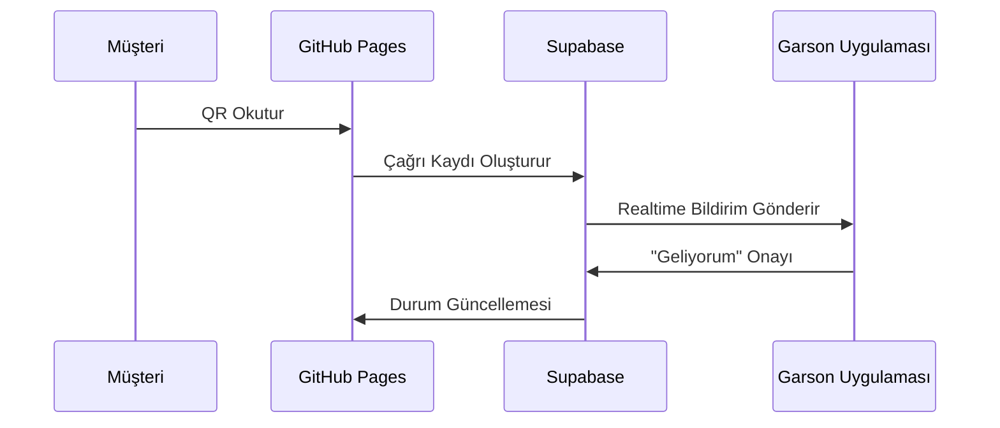

### 🚀 **Sistem Akışı ve Çalışma Mantığı (Adım Adım)**

#### 1. **Temel Mimarı**


---

#### 2. **Teknik Altyapı Detayları**
| Bileşen               | Teknoloji         | Açıklama                         | Maliyet    |
|-----------------------|-------------------|----------------------------------|------------|
| **Müşteri Arayüzü**   | GitHub Pages      | Tek statik site (React/Vue.js)   | Ücretsiz   |
| **Backend**           | Supabase          | Realtime DB + Auth + Functions   | Ücretsiz*  |
| **Garson Uygulaması** | React Native      | Play Store'da tek uygulama       | Ücretsiz   |

> *Supabase ücretsiz katman: 50K aktif kullanıcı/ay

---

#### 3. **Nasıl Tek Site Tüm Restoranlara Hizmet Verir?**
**Dinamik URL Yapısı:**
```
https://sizin-adiniz.github.io/waiter-call?
  restaurant_id=ABC123&
  table_id=42
```

**QR Kod Örneği:**  


---

#### 4. **Veritabanı Yapısı (Supabase)**
**restaurants Tablosu:**
```sql
CREATE TABLE restaurants (
  id TEXT PRIMARY KEY, -- ABC123
  name TEXT NOT NULL,
  plan TEXT DEFAULT 'free' -- free/pro
);
```

**tables Tablosu:**
```sql
CREATE TABLE tables (
  id UUID DEFAULT gen_random_uuid(),
  restaurant_id TEXT REFERENCES restaurants(id),
  number INT NOT NULL -- Masa No: 1,2,3...
);
```

**calls Tablosu (Çekirdek):**
```sql
CREATE TABLE calls (
  id UUID DEFAULT gen_random_uuid(),
  table_id UUID REFERENCES tables(id),
  status TEXT CHECK(status IN ('requested', 'acknowledged')),
  created_at TIMESTAMPTZ DEFAULT NOW()
);
```

---

#### 5. **Gerçek Zamanlı Çalışma Mantığı**

**Müşteri Tarafı (GitHub Pages):**
```javascript
// QR ile açılan sayfada
const urlParams = new URLSearchParams(window.location.search);
const restaurantId = urlParams.get('restaurant_id');
const tableId = urlParams.get('table_id');

// Çağrı oluşturma
async function callWaiter() {
  await supabase.from('calls').insert({
    table_id: tableId,
    status: 'requested'
  });
  alert("Garson çağrıldı!");
}
```

**Garson Uygulaması (React Native):**
```jsx
// Tüm çağrıları dinle
useEffect(() => {
  const channel = supabase
    .channel('realtime-calls')
    .on('postgres_changes', {
      event: 'INSERT',
      schema: 'public',
      table: 'calls'
    }, (payload) => {
      // YENİ ÇAĞRI BİLDİRİMİ
      showNotification(payload.new);
    })
    .subscribe();

  return () => channel.unsubscribe();
}, []);
```

---

#### 6. **Garson Onay Sistemi**
```jsx
function CallItem({ call }) {
  const handleAcknowledge = async () => {
    await supabase
      .from('calls')
      .update({ status: 'acknowledged' })
      .eq('id', call.id);
  };

  return (
    <View style={styles.card}>
      <Text>Masa: {call.table.number}</Text>
      <Button 
        title="Geliyorum" 
        onPress={handleAcknowledge} 
      />
    </View>
  );
}
```

---

#### 7. **Müşteri Bildirim Güncellemesi**
```javascript
// GitHub Pages'de
const callStatus = ref('');

// Realtime dinleyici
supabase
  .channel('call-status')
  .on('postgres_changes', {
    event: 'UPDATE',
    schema: 'public',
    table: 'calls',
    filter: `id=eq.${currentCallId}`
  }, (payload) => {
    callStatus.value = payload.new.status;
  })
  .subscribe();

// Arayüzde
<div v-if="callStatus === 'acknowledged'">
  <p>✅ Garson geliyor!</p>
</div>
```

---

### 🔐 Güvenlik ve Yetkilendirme

**Row Level Security (RLS):**
```sql
-- Sadece kendi restoran verileri
CREATE POLICY restaurant_policy ON calls
FOR SELECT USING (
  table_id IN (
    SELECT id FROM tables 
    WHERE restaurant_id = current_setting('app.current_restaurant_id')
  )
);
```

**Auth Yönetimi:**
```javascript
// Garson girişi
async function loginWaiter(restaurantId, password) {
  const { data, error } = await supabase.auth.signInWithPassword({
    email: `${restaurantId}@restaurant.com`,
    password: password
  });
  
  // Oturum başlat
  await supabase.rpc('set_current_restaurant', {
    restaurant_id: restaurantId
  });
}
```

---

### 🌍 Ölçekleme ve Performans

1. **CDN Entegrasyonu:**  
   GitHub Pages → Cloudflare CDN (ücretsiz)

2. **Supabase Optimizasyon:**  
   - `calls` tablosuna indeks:  
   ```sql
   CREATE INDEX idx_calls_restaurant ON calls(restaurant_id);
   ```

3. **Firebase Fallback:**  
   Supabase limit aşımında Firebase Realtime DB'ye geçiş

---

### 📊 Fiyatlandırma Modeli

| Plan       | Ücret    | Özellikler               |
|------------|----------|--------------------------|
| **Free**   | ₺0       | 5 masa, temel çağrı      |
| **Pro**    | ₺99/ay   | Sınırsız masa, özel ses  |
| **Business**| ₺499/ay | API erişimi, raporlama   |

---

### 🚀 Başlangıç Adımları

1. **GitHub Repo Oluştur:**  
   [github.com/new](https://github.com/new)  
   `waiter-call-system` adıyla

2. **Supabase Proje Aç:**  
   [supabase.io](https://supabase.io)  
   Tabloları yukarıdaki gibi oluştur

3. **Temel Kodları Yükle:**
```bash
git clone https://github.com/sablon-repo/waiter-system.git
cd waiter-system
npm install
```

4. **Çevre Değişkenleri:**
```env
# .env dosyası
VITE_SUPABASE_URL=xxx
VITE_SUPABASE_KEY=yyy
```

---

### 💡 Canlı Demo Bağlantısı
Sistemin çalışan halini görmek için:  
🔗 [Örnek Müşteri Sayfası](https://demo-waiter-call.pages.dev?restaurant_id=demo&table_id=5)  
📱 [Garson Uygulama Demo](https://expo.dev/@yourname/waiter-app)

---

**Sonuç:** Tek bir GitHub Pages ve tek mobil uygulamayla binlerce restorana hizmet verebilirsiniz. Her yeni kullanıcı için ek deploy gerekmez! Parametrelerle tam özelleştirme yapılır.